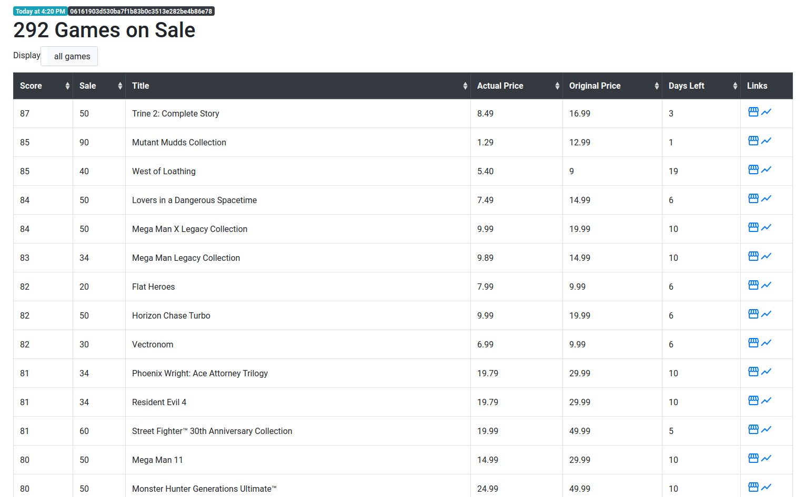

# SWITCHAROO

Fetches the current switch games on sale from the nintendo store. Also looks up the metacritic score. The final result
will be a basic data table, sorted by metacritic rating.
Works for european :video_game: store only.



## Setup

Simply install and run it:

```bash
npm install
npm start
```

Since that's probably the first time starting the application, you'll need to open you browser and navigate to the fetch
endpoint at [http://localhost:3000/fetch](http://localhost:3000/fetch). This may take a while. If everything goes well
you'll be notified with the amount of games found. You'll also find a games.json file at [data/games.json](data/games.json).

At [localhost:3000](http://localhost:3000) you should now find something similar to the sceenshot above. :see_no_evil:

## Sources
Fetching of scores from metacritic is done by [node-metacritic](https://github.com/kocher/node-metacritic)

